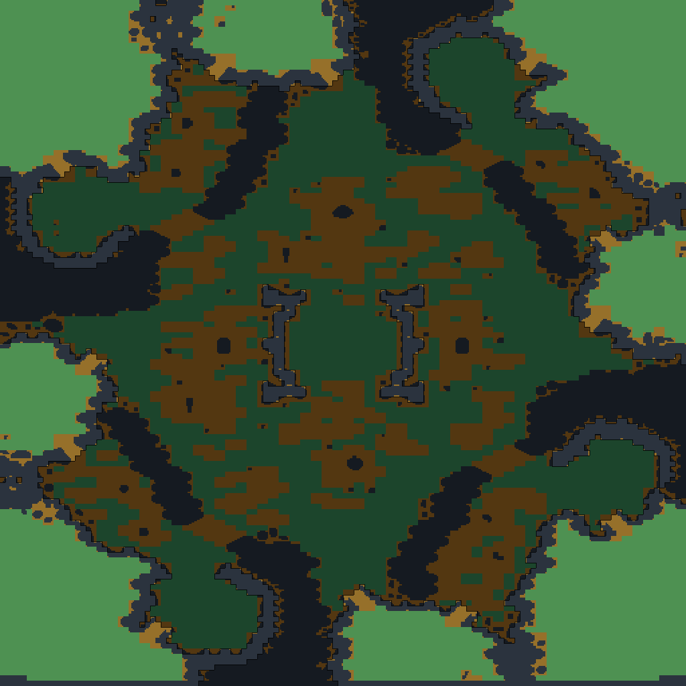

# mapstruct

**See what StarCraft: Brood War's engine actually thinks your map's terrain is.**

Point it at a `.scm` or `.scx` and it draws, for every eighth of a tile, whether you can **walk**
there, whether you can **build** there, and how **high** it is.

```
mapstruct "(4)Fighting Spirit.scx"
```



## Why

The editor shows you tiles. The game plays on something else: a per-eighth-of-a-tile grid of
walkability, a per-tile buildability flag, and three height levels. Most of the time those agree
with what the art suggests. When they do not, you get the bugs map makers know by feel and cannot
see — a wall-in that will not close, a ramp a unit refuses to take, a mineral line that blocks a
building for no visible reason.

The one people usually want is **amber: ground you can walk on but cannot build on.** It is
invisible in the editor and invisible in game, and it decides where a wall-in can go.

## Install

Straight from GitHub — this works today, before any PyPI release:

```
pip install git+https://github.com/jacobrosenthal/mapstruct.git
```

Pin a tag or branch if you want a fixed version:

```
pip install "git+https://github.com/jacobrosenthal/mapstruct.git@v1.0.0"
```

Either way you get a `mapstruct` command on your PATH. If `pip` is not on your PATH, use
`python3 -m pip` (or `py -m pip` on Windows) instead.

Or download a single file from [Releases](https://github.com/jacobrosenthal/mapstruct/releases):

- **`mapstruct.exe`** — Windows, no Python needed. Drop map files onto it.
- **`mapstruct.pyz`** — any OS with Python. `python3 mapstruct.pyz map.scx`

**Nothing else is required.** No StarCraft installation, no Python packages, no compiler. The
tileset tables are inside the tool.

## Use

```
mapstruct MAP [MAP...] [-o OUTDIR] [-s SCALE]

  MAP         a .scm/.scx file, or a folder to search
  -o OUTDIR   where the PNGs go (default: here)
  -s SCALE    pixels per eighth-of-a-tile, 1-16 (default: 4)
```

```
mapstruct Maps/ladder -o pics -s 6        # a whole season at once
```

From Python:

```python
from mapstruct import structure_png

info = structure_png("(4)Fighting Spirit.scx", "fs.png", scale=4)
print(info)   # {'width': 128, 'height': 128, 'unknown_tiles': 0, 'pixels': (2048, 2048)}
```

## Reading the picture

| colour | meaning |
|---|---|
| **slate** | you cannot walk here — cliff faces, water, the sides of ramps |
| **green** | walkable and buildable |
| **amber** | walkable but **not** buildable — ramps, ground under minerals, decoration |
| **magenta** | this build has no data for these tiles (see below) |

Darker is lower ground, lighter is higher, in three steps. Dark contour lines mark every height
change, because a real map is 80–90% one level and a smooth gradient just reads as flat.

Walkability is drawn per **eighth of a tile**, because that is how the game stores it. Buildability
and height are per tile. That mismatch is not a rendering choice — it is why a tile can read as
buildable while one corner of it is not walkable.

## When tiles come out magenta

Tile data changes between game versions. If a map uses tiles this build does not have, they are
drawn magenta and counted:

```
[1/1] (4)Some New Map    128x128 tiles -> pics/Some New Map.png
      -- 2695 tiles (16.4%) are not in this build, drawn magenta; a newer mapstruct may know them
```

That means "get a newer mapstruct", not "your map is broken". It is never guessed at, because a
guess would put walkable ground where there may be none.

To build the tables yourself from your own installation:

```
python3 tools/build_tileset_blob.py /path/to/tileset/files
```

## Building the downloadable artifacts

```
python3 tools/build_pyz.py        # -> dist/mapstruct.pyz   (one file, any OS with Python)
python3 tools/build_exe.py        # -> dist/mapstruct.exe   (needs pip install pyinstaller)
```

`build_pyz.py` uses only the standard library, on purpose: a packaging step that needs `pip` is a
packaging step that fails on someone else's machine, which is the whole thing this tool avoids.

`build_exe.py` needs PyInstaller, and a Windows `.exe` needs Windows. `.github/workflows/build.yml`
builds all three platforms on a tag and attaches them to the release, so no local Windows machine
is required.

## Licence

MIT — see `LICENSE`. Third-party code and game data are described in `NOTICE.md`; the short
version is that mapstruct carries Blizzard's *functional* tile data (what is walkable, what is
buildable, how high) and none of their artwork.

Not affiliated with or endorsed by Blizzard Entertainment.
